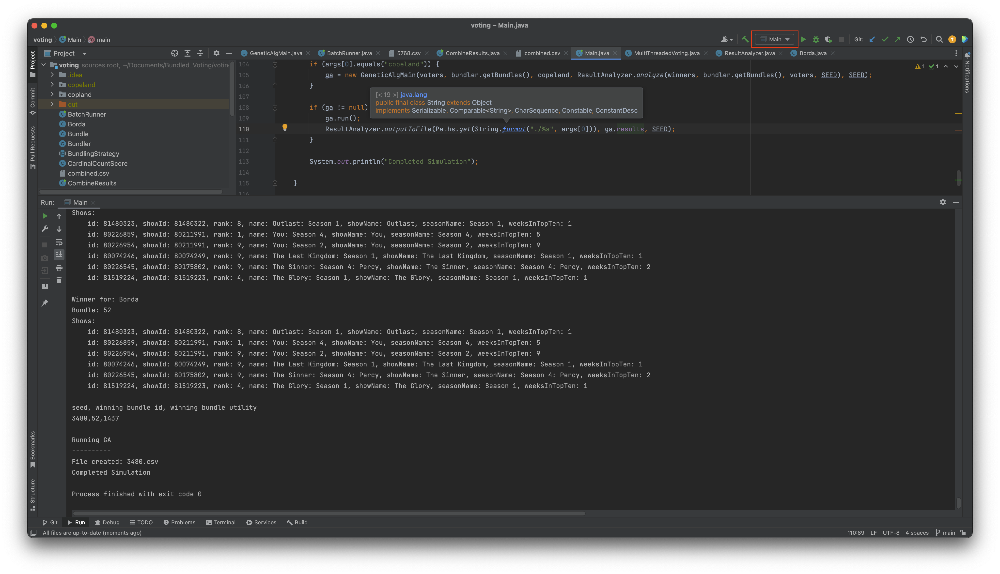
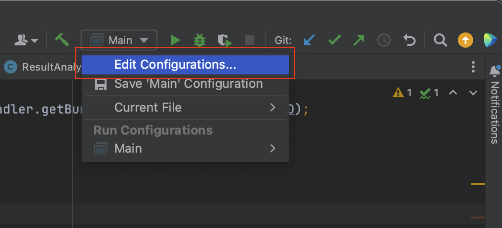
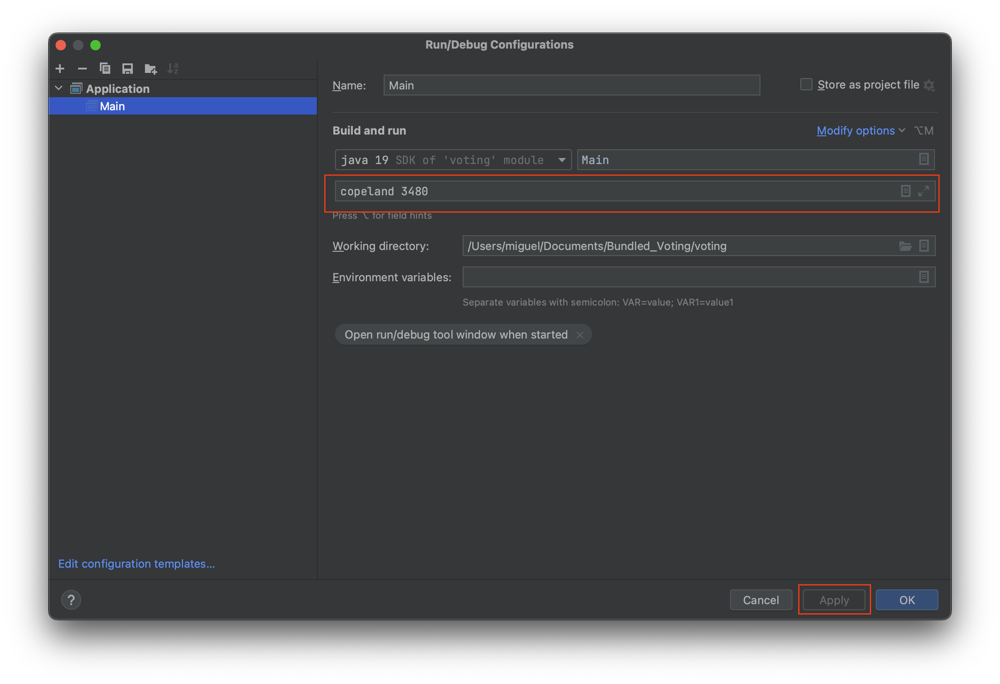

# Bundled Voting

Elevator Speech Paper
 - https://docs.google.com/document/d/1h5wql9IvJUF1hzvvXhurxnuT95-EA_sSU6wkJLmvBEY/edit


Meeting docs
 - https://docs.google.com/document/d/1tmmCE23oCHB0g1yJt9T5NpCd8iGS_7vBLIrCNkqYPGw/edit


Environment design
 - https://docs.google.com/drawings/d/1b3UrDkZxoEjtNRy5ez-SFhETh37kLD5oSqilyFCnLOk/edit


Project Proposal
 - https://docs.google.com/document/d/1GswMZPuQ8KrAVxJus05azvSCF42J4jAOIBWqIxxomJo/edit
 - if this doesn't work, access it from Canvas > groups > (our group) > collaborations
 
Draw.io UML diagram
 - https://drive.google.com/file/d/1skAsdRkspLJPXjZkFzod74yuxsfJpK-P/view?usp=sharing

Citation doc
 - https://docs.google.com/document/d/1IAKnkDSjfNMjP2D23Uc47FDWSqaZAr95m4WXnBznXas/edit

Final Paper
 - https://docs.google.com/document/d/1MDELJEpDkHjpa49ez7AQnYC29bGpByXglz0AHJoHuIo/edit

## Objective

This project provides a program that uses a genetic algorithm coupled with a voting method to select an approximately optimal bundle of 6 Netflix shows to show to viewers. It also provides programs for scraping Top 10 rankings from Netflix and visualizing the data. These programs can be used to assess what shows would likely elicit the greatest viewership and interest if offered in a bundle.

## Instructions on how to run the main program

1. Clone this repository

2. Open the voting directory in a Java IDE. IntelliJ is highly recommended.

3. Compile the project.

4. Run `Main.java` with two arguments the first is the name of the voting method and the second is a seed which is an integer i.e. 

``` zsh 
java Main borda 2437892 
```

`borda` and `copeland` are the options for the voting method. It can also be run via an IDE by specifying the command line arguments in your configuration. In Intellij the first step is to open the modal to edit the configuration. This can be done by pressing the following buttons.


 


Inside of the edit configurations modal you can specify the command line arguments in the outlined textbox. Once you've entered them in you'll need to click apply for them to take effect. Clicking ok should dismiss the modal.



Running this will run a single run of the genetic algorithm. The genetic algorithm will run until it converges to a steady state. The output of the run will be outputted to both the terminal and a csv file. The csv file will be located in a directory with the name of the voting method under a csv file with the name of the seed used.

5. If you want to run 1000 trials of both `borda` and `copeland` in parallel you'll run `BatchRunner.java` i.e. `java BatchRunner`. In `BatchRunner.java` you can adjust how many threads it will run at a time. It's set in the constant `NUMBER_OF_CORES_ON_SYSTEM` this should be set to a number less than or equal to the number of cores on your system for optimal performance. If you want to max out your system, you should set it to the number of cores on your system. This command will output the results of each trial into a csv file. It follows the same naming pattern as running a single trial. This is how we ran the main experiment in our project.

6. If you want to aggregate the results from many trials into a single csv called `combined.csv` you can run `CombineResults.java` i.e. `java CombineResults`. You should only run this, after the trials you've run have finished. This aggregate CSV can be imported into Excel, Tableau, relational databases or other tools for data analysis. This is what we did in our project.


## Instructions on how to run the auxiliary programs

* The web scraper

> The repository has the data already scraped for the experiment we ran so it's not necessary to run the main program. Running the scraper can be used if you want to use a more recent data set.

1. You'll need to have Node.js installed on your machine. See their [website](https://nodejs.org/en) for instructions.

2. You'll need to `cd` into the `scraper` directory and run `npm install`. This installs the parser the web scraper uses to parse HTML. We used an HTML parser from a library as HTML is not a regular language and therefore is tricky to properly parse.

3. `cd` into the `scraper` directory and run `node index.js`. This should output the scraped data into the `data` directory within `scraper`.

* The visualizer

> This is the program used to create the bar charts in the data section.

1. You'll need to have Node.js installed on your machine. See their [website](https://nodejs.org/en) for instructions.

2. You'll need to `cd` into the `visualizer` directory and run `npm install`. This installs `d3` an industry standard library for web based data visualizations.

3. `cd` into the `visualizer` directory and run `npm start`. This will start up a dev server. Once it's done building the program the charts should be visible at [http://localhost:8080](http://localhost:8080).